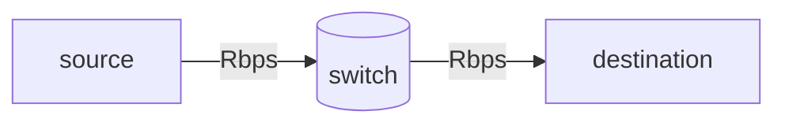

## The network core
{: width="400" height="300" .w-100}

호스트 없이 상호연결된 라우터나 스위치만 있는 부분.

- packet-switching: 호스트가 어플리케이션의 메시지를 부셔서 패킷으로 만든 다음, 네트워크가 라우터를 건너면서 목적지까지 패킷을 전달하는 것.

### Two key network-core functions
{: width="500" height="300" .w-100}

#### Forwarding (aka "switching")
- **local action**
- 라우터의 input link에 패킷이 도착하면 다음엔 어느 스위치로 가야할 지 결정하고 적절한 outputlink로 내보낸다.
- 사진 같은 경우엔 패킷 헤더가 `0111`이니 2번 링크로 나가야 한다.

#### Routing
- **global action**
- 목적지까지의 경로를 결정한다.
- routing algorithms에 따라 경로가 달라질 수 있다.

---

## Packet-switching

### Store-and-forward

- packet transmission delay: L-bit의 패킷을 R bps(bit/sec)으로 보내는데 걸리는 시간은 L/R이다.
- store and forward: 다음 링크로 가기 전에 **반드시 모든 패킷이 라우터에 도착해야 한다.**

> $$ 1 s = 10^{-3}ms $$ (millisecond)  
> $$ 1 s = 10^{-6}us $$ (microsecond)  
> $$ 1 s = 10^{-9}ns $$ (nanosecond)
{: .prompt-tip }

### Queueing
{: width="500" height="300" .w-100}

서비스 속도보다 도착 속도가 더 빠를 때 발생한다. 큐에 있는 패킷들은 자신이 output link를 통해 나갈 때까지 기다린다.

#### Packet queueing and loss
{: width="500" height="300" .w-100}

- (arrival rate > service rate) => queueing delay 발생 => 패킷은 자신의 차례가 올 때까지 기다림.  
** 만약 라우터의 메모리가 가득 차 있으면 패킷은 그대로 dropped됨 (packet lost) **

### Packet switching vs Circuit switching  

{: width="300" height="300"}  

{: width="300" height="300"}

|              | Packet switching | Circuit switching |
|:------------:|:----------------:|:-----------------:|
|sharing       | yes              | no                |
|performance   | not guaranteed   |guranteed          |
|queueing delay| yes              | no                |
|users         |35~               |10                 |

** 패킷 스위치는 성능이 불확실 하지만 많은 사람들이 쓸 수 있는 '확장성'을 지녔다. 오늘날의 인터넷은 패킷 스위치 방식을 택했다.**

서킷 스위칭 방식은 10명의 사용자들이 사용할 수 있지만, 그 10명이 동시에 인터넷을 쓸 확률은 0.0004 보다도 낮다.  따라서, 다른 사람이 안 쓸 때 링크를 공유해서 사용하는 패킷 스위칭이 더 확장성 있다.

---

## Packet delay 

### 4 Sources
{: width="500" height="300"}

$$ delay = d_{proc} + d_{queue} + d_{trans} + d_{prop} $$

- $$ d_{proc} $$ : nodal processing
    - 스위치가 패킷을 보내는 시간
    - microsecs 보다도 작기 때문에 일반적으로 생략

- $$ d_{queue} $$ : ***queueing delay***
    - 패킷이 큐에서 기다리는 시간
    - 패킷 딜레이를 결정하는 중요한 요소

- $$ d_{trans} $$ : transmission delay
    - 전송 시간
    - L/R

- $$ d_{prop} $$ : propagation delay
    - 패킷이 전선을 타고 이동하는 시간
    - d/s (d: 전선 길이, s: 전파 속도)

### Packet queueing delay
queueing delay를 줄이기 위해 일부러 버퍼의 크기를 줄인다.   
=> ** 일부러 packet loss를 발생시켜 패킷이 다른 경로로 가게 끔 한다.**

> 버퍼의 크기가 100 -> max queueing delay = 100s  
> 버퍼의 크기가 10000 -> max queueing delay = 10000s  
> **밑의 경우는 너무 오래 걸리니 차라리 위의 경우에서 packet loss를 발생시키는 것이 낫다.**
{: .prompt-warning }

---

## Throughput
***단위 시간 동안 sender가 receiver에게 보낸 비트의 양***
- instantaneous: 실시간 throughput
- average: 평균 throughput

### Bottleneck link

{: width="500" height="300"}

위의 경우는 $$R_s$$이고 아래의 경우는 $$R_s$$이다.  
이렇게 링크 때문에 throughput이 제한되는 경우를 ***bottleneck link***라고 한다.

---

## ISO/OSI reference model
{: width="500" height="300"}

네트워크를 모듈화 시켰다. 참고로 presentation과 session은 application에 통합됨.

- app: 네트워크 앱을 도와줌 *e.g. HTTP, IMAP, DNS*
- transport: 프로세스끼리의 데이터 전송 *e.g. TCP, UDP*
- network: 데이터 라우팅 *e.g. IP, routing protocols*
- link: 이웃 네트워크와 데이터 전송 *e.g. Ethernet, WiFi, PPP*
- physical: 비트가 전선을 타고 이동

### Services, Layering and Encapsulation
{: width="500" height="300"}

- 장점: 모듈화로 유지보수 용이
- 단점: 헤더 때문에 용량이 늘어남

---

## History
1967: ARPAnet