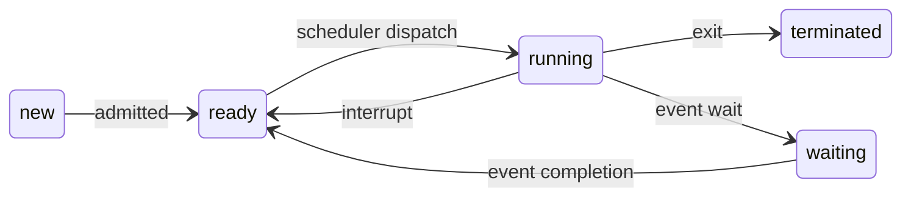

## 1. 프로세스
- 프로그램(program): 디스크에 존재하는 수동적인 존재 (executable file)
- **프로세스(process): 실행 중인 프로그램**, 프로그램이 메모리로 올라왔을 때

### 1-1. 프로세스의 내용
- text: 프로그램 코드
- stack/data/heap: 각각 지역변수, 전역변수, 동적 할당을 담당하는 메모리 공간
- Program Counter(PC): CPU 레지스터 안에 있음. 다음에 실행할 코드의 주소를 저장.
- CPU 레지스터: 연산에 필요한 데이터들.
- PCB(Process Control Block): 프로세스의 정보를 저장한 블록.

### 1-2. 프로세스 상태
프로세스는 실행되는 도중에 상태를 바꾼다.

- new: 프로세스가 만들어진 상태
- ready: 프로세서의 할당을 받길 기다리는 상태
- running: 할당을 받아 실행되는 상태
- waiting: 이벤트가 발생하길 기다리는 상태
- terminated: 프로세스가 실행을 끝낸 상태

### 1-3. 프로세스 스케줄링 큐
- Job queue: 시스템에 있는 프로세스들이 있는 큐, new 상태에 붙어있다 생각하자.
- **Ready queue: 메인 메모리에 있으면서 실행되길 기다리는 프로세스가 있는 큐**
- Device queues: 각 I/O 디바이스 사용을 기다리는 큐

프로세스는 이 큐들 사이를 왔다갔다 한다.

### 1-4. 스케줄러
프로세스들을 어느 큐에 배치할 지 결정한다. Long-term scheduler는 레디 큐의 길이를 결정하기 때문에 멀티프로그래밍의 정도를 결정한다.

|                     | Short-term scheduler | Long-term scheduler |
|---------------------|:--------------------:|:-------------------:|
|                     | CPU scheduler        | job scheduler       |
| ->                  | ready q -> running   | job q -> ready q    |
| invoked             | frequently           | infrequently        |
| speed               | fast                 | slow                |

- Medium-term scheduler: 만약 레디 큐의 길이가 너무 길다 싶으면 프로세스 몇 개를 디스크로 보냈다가, 다시 메모리로 들여올 수 있다. (swapping)

> 프로세스의 종류
- I/O-bound process: I/O 하는 시간이 더 많은 프로세스
- CPU-bound process: 계산하는 시간이 더 많은 프로세스
{: .prompt-info }

---

## 2. Process Control Block (PCB)
프로세스의 정보를 담은 블록
- 프로세스 번호
- CPU 상태
- 프로세스 상태 등

---

## 3. Context Switch
CPU가 다른 프로세스에게 할당될 때 OS는 이 일을 실행한다. 

1. 현재 프로세스 상태를 저장
2. 실행하려는 프로세스의 상태를 불러오기  

이걸 'context switch'라고 한다. 사실 이걸 하는 시간은 CPU를 OS가 점유하고 있기 떄문에 **overhead가 발생한다.**

---

## 4. 프로세스 생성과 종료

### 4-1. 프로세스 생성
프로세스들은 트리 형태로 생성된다. 부모 프로세스가 자식 프로세스를 생성하는 형태이다. 

- 자원 공유
    1. 부모와 자식 프로세스가 모든 자원을 공유
    2. 자식이 부모의 자원 중 일부만 공유
    3. 부모와 자식이 자원을 공유하지 않음

### 4-2. 프로세스 종료
- 정상 종료 (Normal Termination): 프로세스가 마지막 명령어를 실행했을 때
    - return status를 부모 프로세스에게 전달한다.
    - OS에 자원을 반납한다.

- 비정상 종료 (Abnormal Termination): 부모가 자식의 실행을 종료시켰을 때

- 부모가 종료되었을 때
    - 자식도 OS에 의해 종료된다. (cascading termination)
    - 자식이 init 프로세스에 입양된다.

---

## 5. Cooperating Processes
독립적인 프로세스들은 서로의 실행에 영향을 주지도 받지도 않는다. 하지만 협력 프로세스들은 서로 영향을 주고 받는다.

### 5-1. Interprocess Communication
cooperating 프로세스가 협력하기 위해서는 Interprocess Communication (IPC)라는 메커니즘이 필요하다.

- Shared Memory Model (SMM): 한 프로세스가 공유 메모리 공간을 만들면 다른 프로세스가 거기에 붙어서 서로 데이터를 읽고 쓰는 것. 이 방법을 쓰기 위해서는 동시에 두 프로세스가 공유 메모리에 접근하지 못하도록 막는 Synchronization이 필요하다.

- Message-Passing: 공유 메모리를 사용하지 않고 함수를 통해 소통하는 방식. send(msg), receive(msg). 이 방법은 communication link를 어떻게 구축하는지에 따라 두 개로 나뉜다.
    
    - Direct communication: 한 쌍의 프로세스 사이에 하나의 링크만 존재한다.  
        send(P, msg)/receive(Q, msg)

    - Indirect communication: 메시지가 메일 박스를 통해 전달되는 방식. 하나의 메일 박스에 여러 링크가 존재한다. 이 경우에는 2개의 프로세스가 동시에 메일 박스에 접근할 수 있기 때문에 한 번에 하나의 프로세스만 receive() 함수를 쓰게 해야한다.  
        send(M, msg)/receive(M, msg)