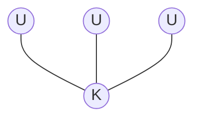
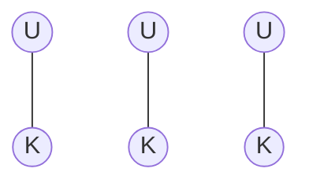
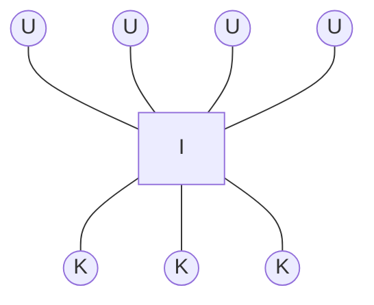
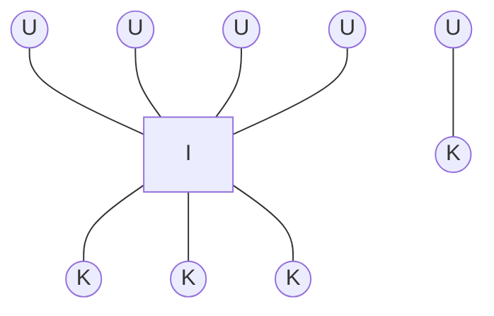
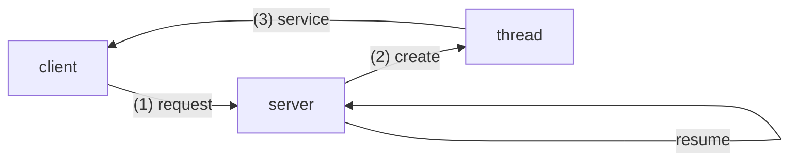
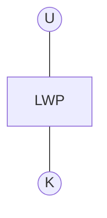

## Thread
프로세스를 스레드 단위로 나누어서 작업한다면 더 효율적으로 일할 수 있다.

- Single-threaded process: 하나의 스레드만 가지는 프로세스. **프로세스는 적어도 하나의 스레드를 가진다.**
- Multithreaded process: 스레드가 여러 개인 프로세스.

### 장점
1. Responsiveness: 응답성이 좋은 프로그램을 만들 수 있다. (실행 중인게 보인다는 뜻)
2. Resource Sharing: 스레드는 IPC가 필요 없기 때문에 shared memory나 message passing을 안 해도 된다. 
3. Economy: 프로세스를 만들고 context-switch를 할 바에야 스레드를 만드는 게 더 이득이다.
4. Utilization of MP Architectures: single-threaded process와 달리 한 프로세스에 여러 개의 CPU가 올 수 있다.

> Concurrency vs Parallelism
- Concurrency: 하나 이상의 일을 진행시키는 것
- Parallelism: 동시에 여러 일을 수행하는 것 (MP Architecture)
{: .prompt-info }

---

## POSIX Pthread
POSIX standard는 스레드의 생성과 동기화를 정의하는 API이다. User-level 또는 Kernel-level에 설치되어야 작동한다.

### User threads 
user-level에 있는 thread library에 의해 관리되는 스레드. 라이브러리가 user-level에 존재하기 때문에 API 함수가 system call을 하지 않고 유저 공간에서만 실행된다.

### Kernel threads
kernel-level에 있는 thread library에 의해 관리되는 스레드. API 함수가 system call을 할 수 있다.

---

## Multithreading Models
유저 스레드와 커널 스레드와의 관계는 어떤 것이 있을 지 알아보자.

### Many-to-One Model
**많은 유저 스레드가 하나의 커널 스레드에 연결된 형태.**

- user-level 스레드 라이브러리에 의해 스레드가 관리됨.
- 만약 하나의 스레드가 중지된다면 프로세스가 통째로 중지될 수 있음. 
- 멀티코어 시스템에서 parallel 하게 작동하는 건 불가능.

### One-to-One Model
**하나의 유저 스레드가 하나의 커널 스레드에 연결된 형태.**

- 하나의 스레드가 중단되어도 전체 프로세스가 중단되지 않음.
- 멀티코어 시스템에서 parallel 하게 동작 가능.
- 한 프로세스 당 생성할 수 있는 스레드의 수 제한.

### Many-to-Many Model
**많은 유저 스레드가 많은 커널 스레드에 연결된 형태**

- 앞의 두 모델의 짬뽕 버전
- 스레드가 중단되면 그 스레드와 연결된 커널 스레드는 다른 스레드를 할당받는다.

|         | Many-to-One Model | One-to-One Model |
|---------|:-----------------:|:----------------:|
|   장점  | 스레드 수에 제한 x | concurrency 보장 |
|   단점  | concurrency 보장 x|  스레드 수에 제한 |

### Two-level Model
**Many-to-Many model과 비슷하지만 하나의 유저 스레드에 하나의 커널 스레드가 오는 것도 허용**

---

## Thread Issues
스레드에 관련된 문제를 알아보고 이를 해결하는 방법도 알아보자.

### Semantics of fork() and exec()
- fork(): 유닉스에서 메모리에 자신을 복사할 때 쓰는 함수
- exec(): 메모리의 프로세스가 특정한 프로그램으로 대체되도록 하는 함수

- 만약 fork() 바로 다음에 exec()을 쓴다면?
    + [ ] fork()는 전체 스레드를 복사해야 한다.
    + [x] fork()는 일부 스레드만 복사해야 한다. -> 어차피 exec()으로 대체되기 때문.

### Thread Cancellation
스레드를 취소시키는 법

- Asynchronous cancellation: 목표 스레드를 '즉시' 종료시킴. -> 다른 스레드와 공유하는 데이터를 업데이트 하는 도중에 중단될 수도 있기 때문에 안전하지 않음.

- Deferred cancellation: 목표 스레드가 종료되어도 되는지 지속적으로 체크하고 안전하게 종료될 때에만 종료시킴.

### Signal Handling
Signal은 유닉스에서 쓰는 interrupt 같은 이벤트다. 시그널을 어느 스레드에게 보내야 할까?
1. 시그널을 발생시킨 스레드에게 *e.g. memory access violation*
2. 프로세스의 모든 스레드에게 *e.g. CTRL-C*
3. 프로세스의 특정한 스레드에게 *e.g. kill(pid, signal)*

### Thread Pools
서버가 클라이언트에게 요청을 받을 때 서버는 새로운 스레드를 만들어 서비스를 제공한다.

그런데 만약 요청이 너무 많이 온다면 어떡할까?  
*답은 스레드 풀을 이용하는 것이다.*

1. 프로세스를 시작할 때 미리 풀에 스레드를 만들어 놓는다.
2. 스레드가 필요할 때 풀에서 하나 꺼내서 할당한다. 만약 스레드가 부족할 땐 대기한다.
3. 스레드 요청이 완료되면 풀에 다시 반납한다.

- 장점
    - 스레드를 미리 만들어 놔서 속도가 약간 빨라진다.
    - 스레드 수 만큼의 사람만 받을 수 있다.

- 스레드 풀 사이즈 결정 요소
    - CPU 개수
    - 메인 메모리 크기
    - 동시 이용자 수

### Thread-Local Storage
각 스레드가 데이터를 저장할 수 있는 곳을 Thread-Local Storage (TLS)라고 한다.  
언뜻 보기엔 stack과 비슷해 보이지만 다르다. 

| stack                 |         Thread-Local Storage          |
|:---------------------:|:--------------------------------------|
|하나의 함수만 볼 수 있음 | 같은 스레드에 속하는 함수끼리 볼 수 있음 |

---

## Scheduler Activations
Many-to-Many model에서 커널과 스레드 라이브러리가 커뮤니케이션 하는 방법을 알아보자. 

### Light-Weight Process (LWP)
커뮤니케이션을 위해 유저 스레드와 커널 스레드 사이에 있는 프로세스이다. 

- 유저 스레드 라이브러리는 LWP 유저 스레드가 돌아가는 virtual processor로 간주한다.
- 실제로 OS가 할당하는 단위는 커널 스레드  

### Upcall과 Upcall Handler
- Upcall: 커널이 스레드 라이브러리에게 특정한 이벤트가 나타났다고 알리는 것.
- Upcall Handler: 유저 스레드 라이브러리가 upcall을 처리하기 위해 *LWP*에서 돌리는 핸들러.

### 스레드 하나가 중단될 때
1. 커널이 스레드를 특정하기 위해 upcall 한다.
2. 커널이 새로 LWP를 할당해서 upcall handler를 실행시킨다.
3. upcall handler는 중지될 스레드의 상태를 저장하고 그 스레드의 LWP를 반납한 뒤, 새로운 LWP에게 다른 스레드를 할당한다.

### 스레드가 다시 준비될 때
1. 커널이 upcall하여 중단되었던 스레드가 run할 준비가 되었다고 알린다.
2. 새로운 LWP에 upcall handler가 실행된다.
3. 중단되었던 스레드까지 포함하여 다시 스레드를 스케줄링 한다.