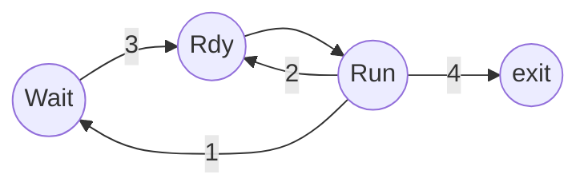

## CPU Scheduler
메모리에 있는 프로세스 중에 실행시킬 프로세스를 선택하고 CPU를 할당한다.

1. running 상태에서 waiting 상태로 간 경우 (I/O 이벤트 대기)
2. running 상태에서 ready 상태로 간 경우 (time out)
3. waiting 상태에서 ready 상태로 간 경우 (I/O 이벤트 완료)
4. terminate 된 경우  

*1, 4 -> **nonpreemptive**, 즉 자발적으로 CPU를 내려놓은 경우*  
*2, 3 -> **preemptive**, 비자발적으로 CPU를 빼앗긴 경우*

---

## Dispatcher
CPU 스케줄러가 선택한 프로세스에게 CPU 권한을 줌.

### Dispatcher의 역할
- context-switch
- kernel-mode에서 user-mode로 변경
- 프로그램을 다시 실행할 때 적절한 위치로 건너뜀

### Dispatch latency 
dispatcher가 실행된 시간, 한 프로세스에서 다른 프로세스로 넘어 가기까지

---

## Scheduling Criteria
스케줄링을 평가하기 위한 기준들을 알아보자.

### CPU utilization
CPU 활용도 -> 최대화

### Throughput
단위 시간만큼 완료한 프로세스의 양 -> 최대화 

### Turnaround time
프로세스를 완료하는데 걸린 시간 -> 최소화

### Waiting time
프로세스가 ready queue에서 대기한 시간 -> 최소화

### Response time
프로세스가 요청되고 나서 첫 반응이 나올 때까지의 시간 (!= turnaround time)

---

## Scheduling Algorithms
스케줄링 하는 알고리즘들에 대해 알아보자. 앞서 언급한 기준을 모두 적용하는 건 복잡하므로 waiting time만 기준으로 삼자.

### First-Come First-Served (FCFS) Scheduling
**선착순으로 프로세스에 CPU를 할당한다.** 어떻게 줄을 서느냐에 따라 성능이 달라진다. 

- Convoy effect: 긴 프로세스들 뒤에 짧은 프로세스들이 있는 경우

### Shortest-Job-First (SJF) Scheduling
**CPU burst 시간이 짧은 순부터 할당한다.**  
이 알고리즘이 가장 긍정적이지만 실제로 쓰진 않는다. 왜? 어떤 프로세스가 가장 짧은 지 모르기 때문이다.

- Nonpreemptive SJF Scheduling: 현재 프로세스의 남은 시간보다 짧은 시간을 가진 프로세스가 와도 바꾸지 않는다.
- Preemptive SJF Scheduling (Shorteset-Remaining-Time-First): 현재 프로세스의 남은 시간보다 짧은 시간을 가진 프로세스가 오면 바꾼다.

#### 프로세스의 CPU burst 예상
- Exponential Average   
    $$T_{n+1} = at_n +(1-a)T_n$$
    - $$t_n$$은 n번째 CPU burst의 길이
    - $$T_{n+1}$$은 다음 CPU burst의 예상
    - $$a$$는 가중치

### Priority Scheduling
**우선 순위 순서로 프로세스에 CPU를 할당한다.**

#### Starvation (indefinite blocking)
우선 순위가 낮은 프로세스는 자신의 차례가 오지 않고 영원히 뒤로 밀릴 수 있다.
> 1973년 MIT의 IBM 7094가 잠시 꺼졌을 때 우선 순위가 낮은 프로세스가 발견되었는데, 그 프로세스는 1967년에 제출되었던 것이었다.

- Aging: 해결책, 시간이 흐름에 따라 우선 순위도 증가시키는 방법

### Round Robin (RR) Scheduling
**각 프로세스가 정해진 time quantum 만큼 돌아가며 CPU를 할당받는다.**  
시간이 지나면 프로세스는 CPU를 빼앗기고 ready queue로 쫓겨난다.

- n개의 프로세스가 q만큼 동안 CPU를 할당받는다 할 때
    - 각 프로세스는 최대 (n-1)*q만큼 기다려야 한다.

- q의 길이
    - 너무 길면 -> CPU 할당 한번 만에 작업이 완료될 수 있음 -> FCFS 스케줄링과 똑같아짐
    - 너무 짧으면 -> 잦은 context-switch로 인한 OS overhead

- SJF보다 turnaround는 길지만 response time이 짧다. (반응성이 좋다.)

### Multilevel Queue Scheduling
**ready queue가 여러 큐들로 나뉘어져 있어서 각 큐마다의 스케줄링 알고리즘 대로 CPU를 할당한다.**  
프로세스를 만들 때부터 어느 큐에 갈 지 정해져 있다. 중간에 큐를 바꾸는 건 불가능하다.

- 큐마다 우선순위 정함 -> starvation의 위험성이 있음
- 큐마다 일정 비율을 정해서 CPU를 할당함 -> starvation 해결

### Multilevel Feedback Queue Scheduling
**단계별로 큐가 만들어져 있어, 시간이 지날 때마다 작업을 못 끝낸 프로세스들은 더 낮은 우선 순위의 큐로 내려간다.** starvation을 방지하기 위해 너무 오래 기다린 프로세스는 높은 우선 순위의 큐로 올라갈 수 있다.

### Multi-Processor System Scheduling
- Asymmetric Multi-Processor System: master 프로세서가 OS를 장관해서 스케줄링이 간단하다.
- Symmertric Multi-Processor System
    - common ready queue를 쓰는 경우: 모든 프로세서가 같은 data structure을 업데이트 할 수 있어 유의해야 한다. 단, load balancing을 안 해도 된다.
    - private ready queue를 쓰는 경우: 프로세서마다 다른 data structure을 써서 꼬일 일이 적다. 하지만 노는 프로세서가 생길 수 있기 때문에 *load balancing을 해야 한다.*

- Load Balancing: push migration과 pull migration을 한다. 즉, 바쁜 프로세서에서 안 바쁜 프로세서로 프로세스를 보내거나 (push migration), 안 바쁜 프로세서가 바쁜 프로세서에서 프로세스를 불러오는 걸 (pull migration) 말한다.
이때 processor affinity를 고려해서 migration 해야한다.

---

## 알고리즘 평가 방법
- Deterministic modeling
- Queueing models
- Simulations
- Implementation