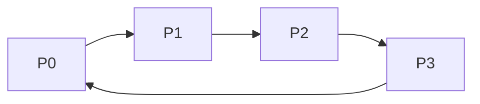
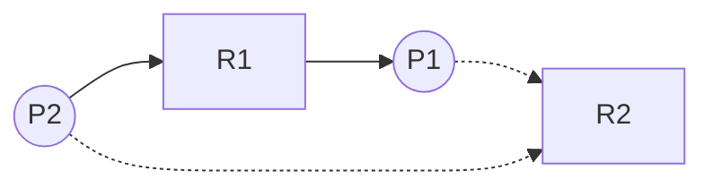
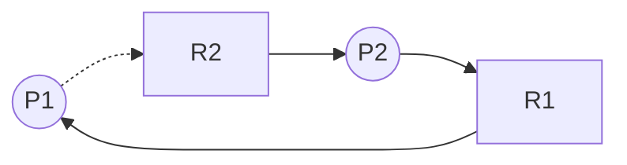

## 1. Deadlock

### 1-1. Deadlock이란?

**Deadlock: 프로세스가 각자 자원을 점유하면서, 다른 프로세스가 점유하고 있는 자원을 기다리는 상태.**

> 도로 하나를 두고 두 자동차가 대립하는 상황으로 비유할 수 있다.
{: .prompt-info }

### 1-2. Deadlock의 조건

:round_pushpin: 아래 4개의 조건을 **동시에 만족하면 deadlock의 가능성이 있다.**

1. **Mutual Exclusion**(상호 배타성): 자원 하나를 프로세스 하나만 쓸 수 있음.
2. **Hold and Wait**(점유하고 대기): 프로세스가 자원을 점유하면서 다른 프로세스의 자원을 요구해야 함.
3. **Non-preemption**(비선점형): 할당된 자원을 뺏어올 순 없고, 프로세스가 스스로 반납해야 함.
4. **Circular Wait**(순환대기): 프로세스들의 자원 요구 그래프가 사이클을 형성해야 함.

그럼 이제 deadlock을 다루는 법에 대해 알아보자.

---

## 2. Deadlock Prevention

:round_pushpin: deadlock의 4가지 조건 중 하나라도 만족하지 않을 시엔, deadlock이 발생하지 않는다.  
 
deadlock prevention은 deadlock 조건을 불만족시켜서 deadlock이 아예 발생하지 않도록 예방하는 방법이다. 그럼 어떻게 각 조건들을 불만족시킬 지 알아보자.

- **Mutual Exclusion**: 이 조건을 불만족시키려면 프로세스끼리 자원을 *공유*해서 써야한다. 이 방법은 다음의 이유로 추천되지 않는다.

> 두 프로세스가 프린터 하나를 공유한다고 치자. 한 프로세스는 `안녕`을 출력하고, 다른 프로세스는 `Hi`를 출력한다. 이렇게 되면 결과는 `안H녕i` `안Hi녕`처럼 이상하게 출력될 것이다.
{: .prompt-warning }

 

- **Hold and Wait**: 프로세스가 실행을 시작할 때에, 필요한 자원을 모두 요청하도록 만든다. 프로세스는 자신이 점유한 자원이 없을 때만 자원을 요구할 수 있다. 이 방법은 낮은 자원 효율성과 starvation을 야기한다.

 

- **Non-preemption**: 만약 자원을 점유한 프로세스가 현재 유효하지 않은 자원을 요구하면, 점유하던 모든 자원을 뺏는다. 해당 프로세스는 요구하던 자원과 빼앗긴 자원을 요구 리스트에 둘 다 추가한다. 나중에 두 자원 모두 할당받으면 프로세스를 다시 시작할 수 있다.

 

- **Circular Wait**: 자원에 순서를 부여하여, 프로세스가 점유한 자원 순서가 요구한 자원의 순서보다 낮을 시에만 자원을 할당받게 만든다.

> _tape drive < disk drive < printer_ 순으로 자원 순서가 정해져 있다면,  
> *tape drive*를 점유하고 *disk drive*를 요구하는건 괜찮지만, *disk drive*를 점유하고 *tape drive*를 요구하는건 안 된다. 이 방법을 쓰면 *printer*를 점유한 프로세스가 *tape drive*를 요구하지 못하게 되어, 사이클이 발생하지 않는다.
{: .prompt-info }

---

## 3. Deadlock Avoidance

이 방법은 deadlock을 원천차단하는 대신, 피해 다니는 방법이다. 자원을 할당하기 전에 시스템이 deadlock에 빠지게 되는지를 판단하여 자원 할당 여부를 결정한다.  
 
:memo: 시스템은 *프로세스의 총 자원 요구량 등과 관련된 추가적인 사전 정보*를 필요로 한다.

### 3-1. Safe State

Safety Algorithm을 돌려 나온 결과에 safe sequence가 존재한다면, 시스템은 현재 Safe State에 머물러 있다. safe sequence에 대해 더 자세한건 3-4에서 다룰 예정이다.  
 
:memo: 프로세스가 자원을 요구하면, _시스템은 이 프로세스에게 할당해도 시스템이 safe state인지 판단해야 한다._

- **safe state** = safe sequence 존재 = deadlock 없음
- **unsafe state** = safe sequence 없음 = deadlock 가능성 있음

### 3-2. Resource Allocation Graph Algorithm

:round_pushpin: 자원 종류에 따라 **각 자원 당 하나의 인스턴스만 존재할 때** 사용하는 알고리즘이다.  
 
프로세스가 자원을 요구하면, *할당하기 전에* 미리 자원을 할당했을 때의 resource allocation graph를 분석한다. 만약 사이클이 존재한다면 할당 시에 unsafe state가 된다는 걸 고려하여 *자원을 할당하지 않는다.\_

- **Claim edge** (dashed line): 프로세스가 자원을 요구할 것이라 표현하는 선
- **Request edge** (solid line): 프로세스가 자원을 요구하는 걸 표현하는 선
- **Assignment edge** (solid line): 자원이 프로세스에 할당된 걸 표현하는 선  
  :memo: 자원이 반납되면 **assignment edge**는 **claim edge**로 변한다. (재할당을 요구할 수 있기 때문)  
   

:smile: safe state: 사이클이 존재하지 않음

 

:worried: unsafe state: 사이클 존재

### 3-3. Banker's Algorithm

:round_pushpin: 자원 종류에 따라 **각 자원 당 여러 개의 인스턴스만 존재할 때** 사용하는 알고리즘이다.
 

자원이 요구되면, _시스템은 이 프로세스에게 할당해도 시스템이 safe state인지 판단해야 한다._

 

Banker's Algorithm을 돌리기 위해선 몇 가지 사전 데이터가 필요하다. 이 데이터들을 필요하기 위한 구조를 알아보자. (프로세스가 n개 존재하고, 자원 종류가 m개 존재한다 가정하자)

- **Available**: m 길이의 벡터  
  :bulb: `Available[j] = k`는 j번째 자원이 k개 이용 가능

- **Max**: n\*m의 행렬  
  :bulb: `Max[i,j] = k`는 i번째 프로세스가 j번째 자원이 최대 k개 필요

- **Allocation**: n\*m의 행렬  
  :bulb: `Allocation[i,j] = k`는 i번째 프로세스가 j번째 자원을 k개 할당받음

- **Need**: n\*m의 행렬  
  :bulb: `Need[i,j] = k`는 i번째 프로세스가 작업을 완료하기 위해선 j번째 자원이 현재 k개 필요

_Need[i,j] = Max[i,j] - Allocation[i,j]_  

-  **Request**: n\*m의 행렬, 현재 각 프로세스가 요구하는 자원의 수 행렬  
   :bulb: `Request[i,j] = k`는 i번째 프로세스가 자원 j를 k개 요구

 

:round_pushpin: Banker's Algorithm은 자원 할당 요구가 들어왔을 때, **자원을 할당했다 가정하고** 그 요구가 safe 한 지 unsafe 한 지 판단한다.  

이제 프로세스로부터 Request가 들어왔을 때 어떻게 알고리즘이 돌아가는 지 알아보자.

1. `Request <= Need` 라면 다음 단계로 넘어간다. 아닌 경우 에러[^error]를 발생시킨다.

2. `Request <= Available` 라면 다음 단계로 넘어간다. 아닌 경우 프로세스는 대기한다.

3. 프로세스에게 자원을 할당했다 _가정하고_, 해당 데이터를 다음과 같이 바꾼다.  
   `Available = Available - Request`  
   `Allocation = Allocation + Request`  
   `Need = Need - Request`

4. Safety Algorithm 으로 state를 판단한다.

- **safe state** -> 프로세스에게 자원 할당
- **unsafe state** -> 프로세스를 대기시키고, 할당 전으로 데이터를 복구한다.

### 3-4. Safety Algorithm

:round_pushpin: 현재 시스템의 state를 판단하기 위한 알고리즘이다. **현재 시스템에 Safe sequence가 있는지 판단하여 state를 결정한다.**  

1. m 길이의 **CurrentAvailable** 벡터와 n 길이의 **Finish** 벡터를 만들고, 다음과 같이 초기화한다. (프로세스가 n개 존재하고, 자원 종류가 m개 존재한다 가정하자)  
   `CurrentAvailable = Available`  
   `Finish[i] = false for i = 0, 1, ..., n-1`

2. 다음 두 조건을 만족하는 i를 찾는다.

   - [x] `Finish[i] == false`
   - [x] `Need <= CurrentAvailable`  
          이러한 i가 존재하지 않는다면, 4단계로 이동한다.  
          :bulb: _여기서 i번째 프로세스는 종료시킬 수 있는 프로세스를 뜻한다._

3. i번째 프로세스를 종료시켰다 가정하고, 다음과 같이 변수를 바꾼다.  
   `CurrentAvailable = CurrentAvailable + Allocation`  
   `Finish[i] = true`  

   2단계로 이동한다.

4. 모든 i에 대하여 `Finish[i] == true`라면 시스템은 safe state이다. **만약 하나라도 `false`가 남을 시, 시스템은 unsafe state에 처해 있다.**

> 종료시킬 수 있는 프로세스를 종료했다 가정하고, Safe sequence를 만드는 것이다. 완성된 Finish 벡터가 Safe sequence라 할 수 있다.
{: .prompt-tip }

### 3-5. Example

현재 시스템의 자원 할당 상태이다. 프로세스는 총 5개가 실행 중이고, 자원은 A, B, C 세 종류가 있다. 여기선 Max를 생각하지 말자.

:traffic_light: 시스템의 현재 상태

| Process | Allocation (A B C) | Need (A B C) | Available (A B C) |
| :-----: | :----------------: | :----------: | :---------------: |
|   P0    |       0 1 0        |    7 4 3     |       3 3 2       |
|   P1    |       2 0 0        |    1 2 2     |                   |
|   P2    |       3 0 2        |    6 0 0     |                   |
|   P3    |       2 1 1        |    0 1 1     |                   |
|   P4    |       0 0 2        |    4 3 1     |                   |

이제 여기서 P1이 `Request(1 0 2)`를 요구한다고 가정하자. 우리가 해야할 것은 Banker's Algorithm을 돌려서 자원을 할당한 상태로 만든 뒤, Safety Algorithm으로 시스템의 state를 판단하는 것이다. safe라면 할당, unsafe라면 대기를 택한다. 그럼 먼저 Banker's Algorithm부터 돌려보자.

 

:triangular_flag_on_post: Banker's Algorithm 과정

1. `Request <= Need`인가? -> `Request(1 0 2) <= Need(1 2 2)` -> 다음 단계로

2. `Request <= Available`인가? -> `Request(1 0 2) <= Available(3 3 2)` -> 다음 단계로

3. 프로세스에게 자원을 할당했다 _가정하고_, 해당 데이터를 다음과 같이 바꾼다.  
   `Available = Available - Request`  
   `Allocation = Allocation + Request`  
   `Need = Need - Request`

 

:traffic_light: P1의 요구를 들어주었다고 가정

| Process | Allocation (A B C) | Need (A B C) | Available (A B C) |
| :-----: | :----------------: | :----------: | :---------------: |
|   P0    |       0 1 0        |    7 4 3     |    **_2 3 0_**    |
|   P1    |    **_3 0 2_**     | **_0 2 0_**  |                   |
|   P2    |       3 0 2        |    6 0 0     |                   |
|   P3    |       2 1 1        |    0 1 1     |                   |
|   P4    |       0 0 2        |    4 3 1     |                   |

P1의 Allocation은 (2 0 0)에서 (3 0 2) 늘었고, Need는 (1 2 2)에서 (0 2 0)으로 줄었다. 또한, Available은 (3 3 2)에서 (2 3 0)으로 줄었다.

이제 P1의 요구를 들어주면 어떻게 되는지 알았으니 시스템의 state를 판단하고, 할당 여부를 결정하자. Safety Algorithm을 돌려서 판단한다.

 

:triangular_flag_on_post: Safety Algorithm 과정

1. `Finish = [0 0 0 0 0]`, `CurrentAvailable = (2 3 0)`로 초기화

2. i = 1을 선택
3. `CurrentAvailable = (2 3 0) + (3 0 2) = (5 3 2)`  
   `Finish = [0 1 0 0 0]`

4. i = 3을 선택
5. `CurrentAvailable = (5 3 2) + (2 1 1) = (7 4 3)`  
   `Finish = [0 1 0 1 0]`

6. i = 4을 선택
7. `CurrentAvailable = (7 4 3) + (0 0 2) = (7 4 5)`  
   `Finish = [0 1 0 1 1]`

8. i = 2을 선택
9. `CurrentAvailable = (7 4 5) + (3 0 2) = (10 4 7)`  
   `Finish = [0 1 1 1 1]`

10. i = 0을 선택
11. `CurrentAvailable = (10 4 7) + (0 1 0) = (10 5 7)`  
    `Finish = [1 1 1 1 1]`

12. 모든 i에 대하여 `Finish[i] == true`이므로 시스템은 safe state에 있다.  
    :memo: Safe sequence = `<P1, P3, P4, P2, P0>` (바뀔 수 있음)

**따라서 P1의 자원 할당 요구를 들어주어도 된다.**

---

## 4. Deadlock Detection
이 방법은 그래프와 알고리즘을 통해 수시로 컴퓨터의 deadlock 여부를 검사하는 방법이다. Deadlock Avoidance와 비슷한 방법이 쓰인다. 

### 4-1. Wait-for Graph

Resource-Allocation Graph와 비슷한 Wait-for Graph를 이용한다. 차이점은 Wait-for Graph에는 Resource 노드가 없어 노드의 수가 적다. 따라서 탐색 시간이 Resource-Allocation Graph보다 짧아 이 그래프를 더 많이 사용한다.  

_좌측의 노드 수보다 우측의 노드 수가 확연히 적다._

### 4-2. Detection Algorithm
:round_pushpin: 간헐적으로 Detection Algorithm을 돌려 현 시스템이 deadlock에 빠져있는지 검사한다.  

Detection Algorithm은 Safety Algorithm의 과정과 똑같으나 차이가 있는데, 바로 Need 행렬 대신 Request 행렬을 쓰는 것이다. 두 행렬을 비교해보자.  

- **Need**(Safety): n\*m의 행렬  
   _Need[i,j] = Max[i,j] - Allocation[i,j]_ 이므로 **Need를 계산하기 위해선 Max가 필요하다.**  
  :bulb: `Need[i,j] = k`는 i번째 프로세스가 작업을 완료하기 위해선 j번째 자원이 현재 k개 필요 

-  **Request**(Detection): n\*m의 행렬, 현재 각 프로세스가 요구하는 자원의 수 행렬  
   :bulb: `Request[i,j] = k`는 i번째 프로세스가 자원 j를 k개 요구

 

두 알고리즘은 각각의 행렬을 사용한다.  

|      Algorithm    |         Safety         |       Detection       |
| :---------------: | :--------------------: | :-------------------: |
|        Max        |            O           |           X           |
|       Need        |            O           |           X           |
| 프로세스 종료 예측 |  **Need로 정확히 예측**  |  **종료될 것이라 가정** |

그럼 이제 알고리즘 과정을 살펴보자.  

 

1. m 길이의 **CurrentAvailable** 벡터와 n 길이의 **Finish** 벡터, nxm 행렬 **Request**를 만들고, 다음과 같이 초기화한다. (프로세스가 n개 존재하고, 자원 종류가 m개 존재한다 가정하자)  
   `CurrentAvailable = Available`  
   `For i = 0, 1, ..., n-1, if Allocation != 0, then Finish[i] = false; Otherwise, Finish[i] = true`  

2. 다음 두 조건을 만족하는 i를 찾는다.

   - [x] `Finish[i] == false`
   - [x] `Request^i <= CurrentAvailable` (Need 대신 Request가 쓰였다.)  
          이러한 i가 존재하지 않는다면, 4단계로 이동한다.  
          
3. i번째 프로세스를 종료시켰다 가정하고, 다음과 같이 변수를 바꾼다.  
   :bulb: _프로세스 종료 가정은 Max가 없으니 진짜 종료된 지는 모른다._  

   `CurrentAvailable = CurrentAvailable + Allocation`  
   `Finish[i] = true`  

   2단계로 이동한다.

4. 모든 i에 대하여 `Finish[i] == true`라면 시스템은 safe state이다. **만약 하나라도 `false`가 남을 시, 시스템은 unsafe state에 처해 있다.** Finish[i] = false라면 프로세스 i가 deadlock에 처해있다.

 

만약 Detection Algorithm의 가정이 틀렸더라도, 이후에도 계속 알고리즘을 수시로 돌려서 deadlock을 발견할 수 있다.  

:bulb: Detection Algorithm의 단점
- 자주 실행시킬 경우 -> overhead 발생
- 가끔 실행시킬 경우 -> deadlock 감지 어려움

---

## 5. Recovery from Deadlock
deadlock이 발생했을 때 어떻게 해야할까?

### 5-1. Process Termination
Deadlock에 걸린 모든 프로세스를 종료시키거나, 희생자 프로세스를 하나 지정하여 종료시킨다.  

:bulb: 희생자 프로세스를 지정할 때 고려사항
- 우선순위가 낮은 프로세스
- 실행시킨지 얼마되지 않은 프로세스
- 자원을 많이 할당받은 프로세스

### 5-2. Resource Preemption
희생자 프로세스를 죽이는 대신 자원을 빼앗는다.

:bulb: Rollback
- 희생된 프로세스를 종료된 시점부터 다시 실행시킨다.
- 이를 위해선 시스템이 현재 실행되는 프로세스의 상태 정보를 더 많이 기록해야 한다.

:bulb: Starvation
- 같은 프로세스가 항상 희생자로 선택되는 경우, 그 프로세스는 Starvation에 시달린다.
- 따라서 프로세스마다 rollback 횟수를 기록하여 이미 rollback 되었던 프로세스는 다시 희생되지 않도록 한다.

---

[^error]: 요구하는 자원이 필요한 자원보다 많다는 것은 프로세스가 그의 최대 요구량을 벗어났다는 뜻이다. 따라서 에러를 발생시켜 Need를 다시 계산해야 한다.
